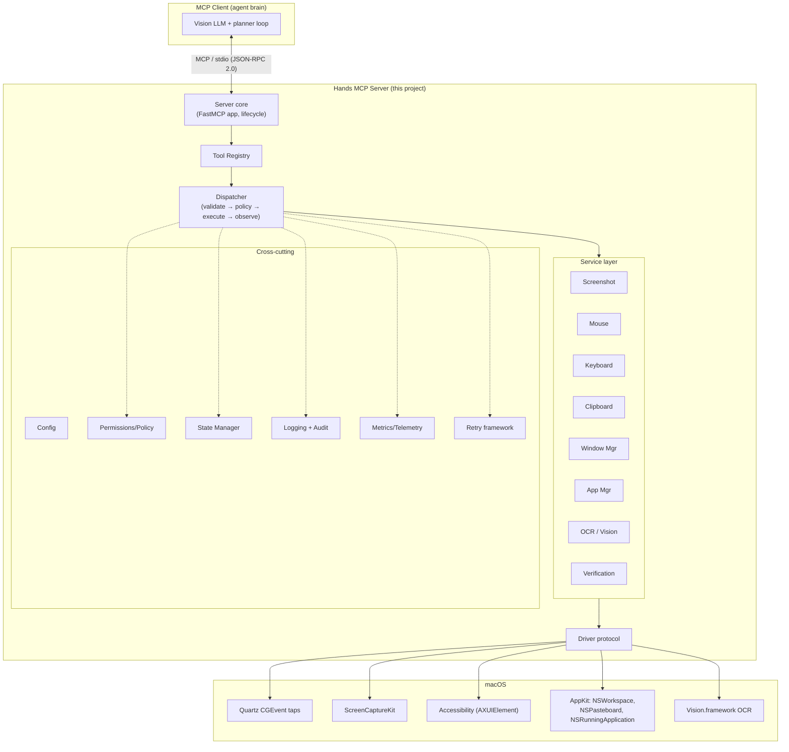
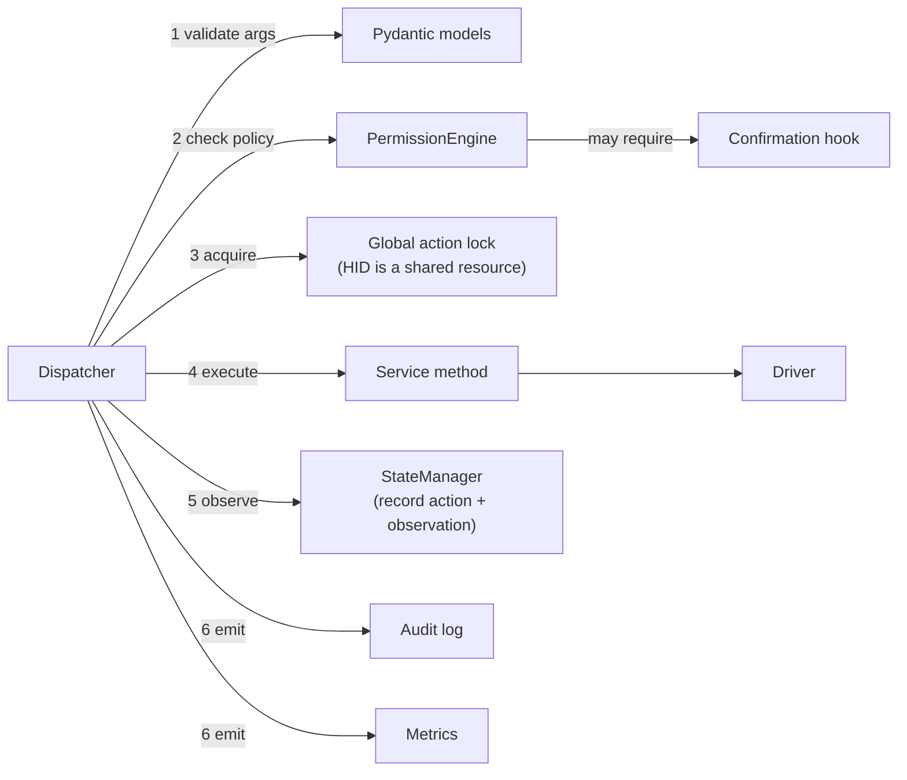
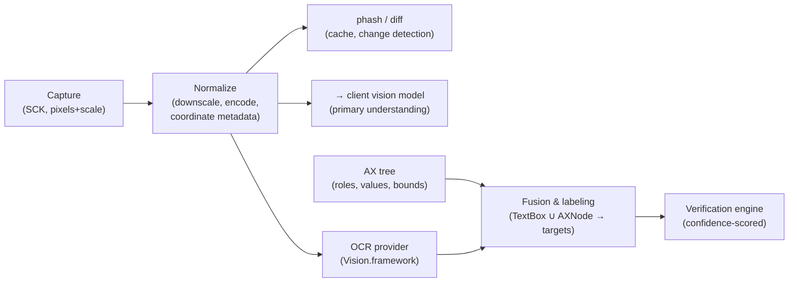

# Hands — Technical Design Document

**A desktop automation framework exposing a macOS computer-use interface to autonomous AI agents over the Model Context Protocol (MCP).**

| | |
|---|---|
| Status | Draft v1.0 |
| Date | 2026-07-03 |
| Target platform | macOS 13+ (Ventura and later), Python ≥ 3.12 |
| Transport | MCP over stdio (Streamable HTTP as a future option) |

---

## Table of Contents

1. [Executive Summary](#1-executive-summary)
2. [System Architecture](#2-system-architecture)
3. [Repository Structure](#3-repository-structure)
4. [Module Design](#4-module-design)
5. [Tool Specifications](#5-tool-specifications)
6. [Internal APIs](#6-internal-apis)
7. [Code Skeleton](#7-code-skeleton)
8. [State Management](#8-state-management)
9. [Error Recovery](#9-error-recovery)
10. [Vision Pipeline](#10-vision-pipeline)
11. [Extensibility](#11-extensibility)
12. [Testing Strategy](#12-testing-strategy)
13. [Security](#13-security)
14. [Performance](#14-performance)
15. [Future Roadmap](#15-future-roadmap)

---

## 1. Executive Summary

Hands is the "body" of an autonomous desktop agent. A vision-capable model (the "brain") runs elsewhere — in an MCP client such as Claude Code, Claude Desktop, or a custom agent loop — and drives the local machine through a small, well-specified set of MCP tools: *look* (screenshots, OCR, UI tree), *act* (mouse, keyboard, clipboard, windows, apps), and *verify* (post-action observation and assertions).

The framework's core bet is a strict separation between **perception/action primitives** (this server) and **planning/reasoning** (the client model). Hands does not decide *what* to do; it makes *doing it* reliable, observable, safe, and fast.

### 1.1 Goals

- **Reliability.** Every action is validated before execution, observable after execution, and classified on failure (retryable vs. fatal). Agents get structured errors, never silent no-ops.
- **Grounded perception.** Screenshots carry explicit coordinate metadata (display bounds, Retina scale factor, capture timestamp) so a model's pixel coordinates map deterministically to real input events.
- **Safety by default.** OS-level TCC permission preflight, a deny-list of sensitive apps/regions, per-tool confirmation policies, rate limiting, an emergency kill switch, and a tamper-evident audit log.
- **Extensibility.** New tools ship as plugins discovered via Python entry points; the core server never needs modification to gain capabilities.
- **Testability.** All OS interaction goes through a single `Driver` protocol with a fake in-memory implementation, so 95% of the codebase is testable on any machine (including Linux CI).
- **Low latency.** Sub-100 ms input actions; sub-300 ms downscaled screenshots; content-hash caching to skip redundant captures.

### 1.2 Non-goals

- **Not an agent.** No LLM calls, no autonomous planning loop, no goal decomposition inside the server. (A thin optional `execute_sequence` batching tool exists for latency, not intelligence — see §5.16.)
- **Not cross-platform in v1.** The architecture isolates macOS specifics behind `Driver`, but Linux/Windows drivers are roadmap items (§15), not v1 deliverables.
- **Not a browser automation framework.** DOM-level control (CDP/Playwright) is a complementary tool; Hands operates at the OS pixel/event layer.
- **Not a security boundary.** Hands enforces *policy* (what the agent may do) but runs with the user's OS privileges; it is not a sandbox for untrusted code.
- **No remote desktop / multi-machine control in v1** (roadmap, §15).

### 1.3 Supported use cases

| Use case | What Hands provides |
|---|---|
| Autonomous desktop copilots | Full perceive→act→verify primitive set |
| QA agents / UI regression testing | Deterministic actions, verification engine, screenshot artifacts |
| Workflow automation (RPA-style) | Sequenced actions, wait conditions, app/window management |
| Coding agents that must use GUI tools | Launch/focus IDEs, simulators, design tools |
| Accessibility research | AX-tree extraction alongside pixels |
| Human-in-the-loop assistants | Confirmation policies, audit trail, kill switch |

### 1.4 Example workflows

**Workflow A — "Export the chart from Numbers and email it":**
1. `app_open(bundle_id="com.apple.Numbers")` → 2. `screenshot()` → model locates the chart → 3. `mouse_click(x, y, button="right")` → 4. `screenshot(region=...)` → model reads context menu via pixels/OCR → 5. `mouse_click(...)` on "Export…" → 6. `keyboard_type("chart.png")`, `key_press("Return")` → 7. `verify(condition={"type":"text_present","text":"Export complete"})` → 8. continue in Mail.

**Workflow B — QA smoke test:**
`app_open` the app under test → `wait(condition={"type":"window_present","title":"Login"})` → `find_text("Username")` returns OCR box → click, type credentials → `key_press("Return")` → `verify(text_present="Dashboard")` → capture screenshot artifact for the test report.

**Workflow C — recovery mid-task:** an unexpected "Software Update" dialog appears; the model's post-action verification fails; it calls `screenshot()`, recognizes the dialog, `window_list()` to confirm the modal, clicks "Later", re-verifies, resumes (see §9.5).

---

## 2. System Architecture

### 2.1 High-level architecture



**Why this layering.** Three alternatives were considered:

1. *Flat tools calling pyautogui directly* (the typical hobby server). Fast to write; untestable, unpoliced, no coordinate correctness on Retina, no recovery metadata. Rejected.
2. *Microservice split* (separate perception and action daemons). Clean isolation but adds IPC latency to a latency-critical path and complicates the TCC permission story (each daemon needs its own Screen Recording grant). Rejected for v1.
3. *Single process, layered, driver-abstracted* (chosen). One TCC-granted process; services are plain classes (unit-testable); one `Driver` seam gives us fakes for CI and a portability path.

### 2.2 Component interaction



### 2.3 Sequence — a `mouse_click` request lifecycle

```mermaid
sequenceDiagram
    participant C as MCP Client
    participant S as Server core
    participant D as Dispatcher
    participant P as PermissionEngine
    participant M as MouseService
    participant Drv as MacOSDriver
    participant St as StateManager

    C->>S: tools/call mouse_click {x:512, y:384}
    S->>D: dispatch("mouse_click", args, ctx)
    D->>D: parse args → ClickArgs (Pydantic)
    D->>P: authorize(action)
    alt denied
        P-->>D: PolicyDenied(reason)
        D-->>C: error result {code:"POLICY_DENIED", ...}
    else allowed (maybe after confirmation)
        D->>D: acquire action lock
        D->>M: click(Point(512,384), LEFT, count=1)
        M->>M: clamp/validate against display bounds
        M->>Drv: post_mouse_event(move) ; post_mouse_event(down/up)
        Drv-->>M: ok
        M-->>D: ClickResult(final_cursor=(512,384))
        D->>St: record ActionRecord + invalidate screenshot cache
        D-->>C: {ok:true, cursor:{x:512,y:384}, screen_dirty:true}
    end
```

### 2.4 Data flow

- **Inbound:** JSON-RPC params → Pydantic argument models (single validation point) → typed value objects (`Point`, `Region`, `KeyChord`) → service calls.
- **Outbound:** service results (dataclasses) → `ToolResult` envelope → MCP content blocks. Screenshots flow as MCP `ImageContent` (base64 PNG/JPEG) plus a structured JSON sidecar block with coordinate metadata.
- **Sideband:** every dispatch appends an `ActionRecord` to the `StateManager` ring buffer and a JSONL line to the audit log; metrics counters/histograms update in-process and export on demand.

### 2.5 Request lifecycle (normative)

Every tool call passes through exactly these phases, implemented once in the Dispatcher (tools cannot skip phases):

1. **Decode & validate** — Pydantic model; failure → `INVALID_ARGS` (never retryable).
2. **Preflight** — OS permission check (cached), kill-switch check, staleness rules (e.g., coordinate actions may require a screenshot newer than `max_screenshot_age`).
3. **Policy** — PermissionEngine evaluates tool + target (app, region, text content) against profile; may invoke the confirmation hook.
4. **Serialize** — acquire the global action lock (input events must never interleave; see §14.5).
5. **Execute** — service call, wrapped by the retry policy declared for that tool.
6. **Observe** — update `StateManager` (cursor, focus, screenshot dirty flag); optionally auto-capture a post-action thumbnail if `config.observe.auto_capture` is on.
7. **Record & respond** — audit line, metrics, structured `ToolResult`.

### 2.6 MCP lifecycle

- **Startup:** parse config → init logging → run *permission preflight* (`CGPreflightScreenCaptureAccess`, `AXIsProcessTrusted`) → build the DI container → discover plugins → register tools → start FastMCP stdio loop. If TCC permissions are missing, the server still starts but every tool returns `PERMISSION_MISSING` with remediation instructions (System Settings deep-links) — this is deliberate, so clients can surface actionable guidance rather than a dead server.
- **`initialize` handshake:** advertise capabilities (`tools`, `logging`); expose server metadata including display topology so clients can plan before the first screenshot.
- **Runtime:** stdio request loop; `notifications/tools/list_changed` emitted if a plugin hot-loads (v1: plugins load at startup only).
- **Shutdown:** on stdin EOF/SIGTERM: release any held modifier keys (critical — a crash mid-`hotkey` must not leave ⌘ held down), flush audit log, stop metrics, exit 0. A `finally`-guarded `KeyboardService.release_all()` is the single most important shutdown behavior.

---

## 3. Repository Structure

```
hands/
├── pyproject.toml              # uv-managed; entry points; dependency groups
├── README.md
├── docs/
│   ├── DESIGN.md               # this document
│   ├── SECURITY.md             # threat model, responsible-use policy
│   └── plugins.md              # plugin author guide
├── src/hands/
│   ├── __init__.py             # version, public re-exports
│   ├── __main__.py             # `python -m hands` → cli.main()
│   ├── cli.py                  # argparse: serve, doctor, permissions
│   ├── server.py               # FastMCP app assembly + lifecycle
│   ├── container.py            # DI container (service wiring)
│   ├── config.py               # layered config (defaults < file < env < CLI)
│   ├── errors.py               # exception hierarchy + error codes
│   ├── types.py                # Point, Region, DisplayInfo, KeyChord, enums
│   ├── registry.py             # ToolRegistry + ToolSpec
│   ├── dispatcher.py           # the 7-phase pipeline (§2.5)
│   ├── state.py                # StateManager, ActionRecord, ObservationRecord
│   ├── retry.py                # RetryPolicy, backoff, error classification
│   ├── permissions.py          # PermissionEngine, profiles, confirmation hook
│   ├── audit.py                # AuditLogger (JSONL, hash-chained)
│   ├── logging_setup.py        # structlog config; MCP log forwarding
│   ├── metrics.py              # counters/histograms; telemetry exporter
│   ├── driver/
│   │   ├── __init__.py         # Driver protocol + get_driver() factory
│   │   ├── base.py             # Driver Protocol definition
│   │   ├── macos.py            # pyobjc implementation (Quartz/SCK/AX/AppKit)
│   │   └── fake.py             # in-memory virtual desktop for tests
│   ├── services/
│   │   ├── __init__.py
│   │   ├── screenshot.py       # capture, scaling, encoding, cache
│   │   ├── mouse.py            # move/click/drag/scroll
│   │   ├── keyboard.py         # type/press/hotkey; layout-safe unicode typing
│   │   ├── clipboard.py        # get/set/paste
│   │   ├── windows.py          # list/focus/move/resize/minimize/close
│   │   ├── apps.py             # launch/activate/quit/list
│   │   ├── ocr.py              # OCRProvider protocol + AppleVisionOCR
│   │   ├── vision.py           # image utils: diff, phash, annotate, crop
│   │   ├── coords.py           # CoordinateMapper (points↔pixels, displays)
│   │   ├── waiter.py           # wait-for-condition engine
│   │   └── verification.py     # VerificationEngine + strategies
│   ├── tools/                  # thin MCP-facing tool definitions
│   │   ├── __init__.py         # register_builtin_tools(registry, container)
│   │   ├── observe.py          # screenshot, find_text, get_ui_tree, wait, verify, get_state
│   │   ├── pointer.py          # mouse_move/click/drag/scroll
│   │   ├── typing.py           # keyboard_type, key_press, hotkey
│   │   ├── clipboard.py        # clipboard_get/set/paste
│   │   ├── windows.py          # window_list/focus/manage
│   │   ├── apps.py             # app_open/close/list
│   │   └── sequence.py         # execute_sequence (batched actions)
│   └── plugins/
│       ├── __init__.py         # PluginManager, entry-point discovery
│       └── api.py              # HandsPlugin protocol, PluginContext (stable API)
├── tests/
│   ├── conftest.py             # fixtures: fake driver, container, dispatcher
│   ├── unit/                   # per-module tests against FakeDriver
│   ├── contract/               # same suite run against fake AND real driver
│   ├── integration/            # dispatcher pipeline, plugin loading
│   ├── e2e/                    # real macOS: drives a Tk fixture app
│   │   └── fixture_app.py      # deterministic target app for e2e
│   └── perf/                   # latency benchmarks (pytest-benchmark)
└── .github/workflows/ci.yml    # lint+unit on Linux; e2e on macos-14 runner
```

### 3.1 File-by-file specification

For each file: **R** = responsibility, **API** = public API, **Int** = notable internals, **Dep** = dependencies, **Size** = expected size, **Ext** = future extensions.

**`src/hands/server.py`** — R: assemble and run the MCP server. API: `build_server(config) -> FastMCP`, `run()`. Int: lifespan context manager (startup preflight, shutdown `release_all`). Dep: `mcp` SDK, container, registry, dispatcher. Size: ~150 lines. Ext: Streamable HTTP transport, hot plugin reload.

**`src/hands/container.py`** — R: construct all services in dependency order; single composition root. API: `class Container`, `Container.build(config) -> Container`, typed attributes per service. Int: driver selection (`fake` vs `macos`) from config/env. Dep: every service module. Size: ~120 lines. Ext: scoped containers for multi-session HTTP transport.

**`src/hands/config.py`** — R: typed configuration. API: `HandsConfig` (Pydantic Settings) with nested `ScreenshotConfig`, `SecurityConfig`, `RetryConfig`, `ObserveConfig`, `TelemetryConfig`; `load_config(path|None, cli_overrides) -> HandsConfig`. Int: precedence defaults < `~/.config/hands/config.toml` < `HANDS_*` env < CLI. Dep: `pydantic-settings`. Size: ~200 lines. Ext: per-profile config bundles.

**`src/hands/errors.py`** — R: the one exception hierarchy + wire error codes. API: `HandsError(code, message, retryable, details)`, subclasses `InvalidArgsError`, `PolicyDeniedError`, `PermissionMissingError`, `TargetNotFoundError`, `StaleScreenshotError`, `DriverError`, `TimeoutError_`, `KillSwitchError`. Size: ~120 lines. Ext: error-code registry doc generation.

**`src/hands/types.py`** — R: shared value objects. API: `Point`, `Region`, `Size`, `DisplayInfo(id, bounds_pt, scale)`, `MouseButton`, `KeyChord.parse("cmd+shift+p")`, `WindowInfo`, `AppInfo`, `TextBox(text, region, confidence)`. Frozen dataclasses; all coordinates are **logical points, top-left origin of the main display** (§4.12). Size: ~250 lines. Ext: 3-D/multi-space coordinates.

**`src/hands/registry.py`** — R: hold `ToolSpec`s (name, description, args model, handler, policy class, retry policy, idempotency flag). API: `ToolRegistry.register(spec)`, `.get(name)`, `.list_specs()`, `.to_mcp_tools()`. Int: duplicate-name detection; JSON-schema generation from Pydantic. Size: ~130 lines. Ext: tool versioning, deprecation metadata.

**`src/hands/dispatcher.py`** — R: §2.5 pipeline. API: `Dispatcher.dispatch(name, raw_args, ctx) -> ToolResult`. Int: `anyio.Lock` action lock; phase timing for metrics. Dep: registry, permissions, state, retry, audit, metrics. Size: ~250 lines. Ext: per-tool concurrency classes (read-only tools bypass the lock).

**`src/hands/state.py`** — R: session memory (§8). API: `StateManager`, `.record_action()`, `.record_observation()`, `.latest_screenshot`, `.cursor`, `.focused_app`, `.history(n)`, `.mark_screen_dirty()`. Int: bounded `deque`s; monotonic clocks. Size: ~220 lines. Ext: persistence for crash recovery.

**`src/hands/retry.py`** — R: declarative retries. API: `RetryPolicy(max_attempts, base_delay, max_delay, retry_on)`, `execute_with_retry(fn, policy, classify)`. Int: full-jitter exponential backoff; refuses to retry non-idempotent actions after ambiguous failures (§9.8). Size: ~140 lines.

**`src/hands/permissions.py`** — R: policy decisions (§13). API: `PermissionEngine.authorize(ActionDescriptor) -> Decision`, `Profile` (allow/deny/confirm rules), `ConfirmationHook` protocol. Int: rule matchers on tool name, app bundle id, screen region, typed-text patterns. Size: ~260 lines. Ext: signed remote policy bundles.

**`src/hands/audit.py`** — R: append-only JSONL audit with hash chaining. API: `AuditLogger.record(event)`, `.verify_chain()`. Size: ~100 lines. Ext: OS keychain-backed signing.

**`src/hands/metrics.py`** — R: in-process counters/histograms + optional OTLP export. API: `Metrics.counter(name).inc()`, `.histogram(name).observe(v)`, `snapshot()`. Size: ~120 lines.

**`src/hands/driver/base.py`** — R: the OS seam. API: `class Driver(Protocol)` — full signature list in §6.1. Size: ~120 lines (protocol + docstrings). Ext: capability flags (`supports_ax`, `supports_sck`).

**`src/hands/driver/macos.py`** — R: real implementation. Int: Quartz `CGEventCreateMouseEvent/Post`, `CGEventKeyboardSetUnicodeString` typing, ScreenCaptureKit capture with `screencapture` CLI fallback, `AXUIElement` tree walks, `NSWorkspace`/`NSRunningApplication`, `NSPasteboard`. Dep: `pyobjc-framework-Quartz`, `-Cocoa`, `-ApplicationServices`, `-Vision`, `-ScreenCaptureKit`. Size: ~700 lines (largest file; split into `macos/` package if it exceeds ~800). Ext: ScreenCaptureKit streaming.

**`src/hands/driver/fake.py`** — R: virtual desktop for tests: a PIL-rendered screen model, virtual windows/apps, scripted dialogs, injectable failures. API: same protocol + test helpers (`add_window`, `fail_next(op, exc)`, `pop_events()`). Size: ~400 lines. Ext: record/replay of real sessions.

**Service files (`services/*.py`)** — each ~120–300 lines; responsibilities in §4; APIs in §6. `verification.py` and `ocr.py` carry the most logic.

**Tool files (`tools/*.py`)** — thin: argument model + `ToolSpec` + a handler that calls one service method and shapes the result. ~60–150 lines each. All business logic lives in services; a tool file with an `if` statement about *how* to act (not *what to return*) is a code smell.

**`src/hands/plugins/api.py`** — R: the *only* import surface plugin authors may use; semver-stable. API: `HandsPlugin` protocol, `PluginContext` (registry + service accessors + config namespace + logger). Size: ~90 lines.

---

## 4. Module Design

Each subsection: purpose, design, alternatives considered, and the chosen trade-off.

### 4.1 MCP server (`server.py`)

Built on the official `mcp` Python SDK's **FastMCP** app, but tools are registered **programmatically from the ToolRegistry** rather than with `@mcp.tool()` decorators. Decorators couple tool definitions to import time and make plugin registration and policy annotation awkward; a registry keeps one uniform path for built-ins and plugins. Alternative — hand-rolled JSON-RPC loop — rejected: the SDK tracks protocol revisions (content blocks, structured output) for free.

### 4.2 Tool registry (`registry.py`)

A `ToolSpec` is data, not code: `name`, `description` (written for LLM consumption — this is prompt engineering surface), `args_model: type[BaseModel]`, `handler`, `retry: RetryPolicy`, `idempotent: bool`, `policy_class: Literal["read","act","sensitive"]`. The registry serializes specs to MCP tool schemas. Policy class drives default permission behavior (§13.3).

### 4.3 Tool dispatcher (`dispatcher.py`)

Owns the seven-phase pipeline (§2.5). Key decision: **one global action lock** serializing state-mutating tools. HID event injection is a machine-global shared resource; two interleaved drags corrupt both. Read-only tools (`screenshot`, `window_list`, `find_text`) declare `policy_class="read"` and bypass the lock. Alternative — per-service locks — rejected: mouse and keyboard interleaving is exactly the dangerous case, and cross-lock ordering invites deadlocks for zero real concurrency win on one physical desktop.

### 4.4 Screenshot service (`services/screenshot.py`)

Capture via `Driver.capture(region|display) -> RawFrame(pixels, scale, bounds_pt, ts)`. The service then: (1) optionally downscales to `config.screenshot.max_dim` (default 1568 px long edge — matched to vision-model input budgets), (2) encodes PNG (UI text) or JPEG q80 (photos) by content heuristic or arg, (3) computes a perceptual hash, (4) stores in the `ScreenshotStore` (§8.1). If the phash matches the previous frame and `screen_dirty` is false, returns the cached frame with `cached: true` — models frequently re-screenshot identical screens.

macOS capture backend: **ScreenCaptureKit** (`SCScreenshotManager`) primary; `/usr/sbin/screencapture -x` CLI fallback (slower ~150 ms extra, but bulletproof). `CGWindowListCreateImage` rejected: deprecated since macOS 14 and warns to console.

### 4.5 Mouse controller (`services/mouse.py`)

Primitives: `move`, `click(point, button, count)`, `drag(path, duration)`, `scroll(dx, dy, ticks|pixels)`, `position()`. All coordinates validated/clamped against display bounds *in points*. Clicks are move→down→up with small configurable delays (default 8 ms) because some apps ignore zero-interval synthetic clicks. Drags interpolate ≥ 20 intermediate move events over `duration` (default 300 ms) — many drop targets require motion, not teleportation. Scrolling uses `CGEventCreateScrollWheelEvent` with pixel-precise units on macOS.

### 4.6 Keyboard controller (`services/keyboard.py`)

Two distinct paths, deliberately:
- **`type_text(text)`** uses `CGEventKeyboardSetUnicodeString` — layout-independent Unicode injection. Never key-code simulation for text: key codes depend on the active keyboard layout (QWERTY vs. Dvorak vs. international) and break on non-ASCII. Chunked (default 32 chars per event batch, 8 ms inter-chunk) because some apps drop long unicode-string events.
- **`press(chord)`** uses real virtual key codes + modifier flags for shortcuts (⌘C must be *the ⌘C key event*, not the character). `KeyChord.parse` accepts `"cmd+shift+p"`, `"ctrl+alt+delete"`, `"F5"`, `"Return"`; a canonical key-name table lives in `types.py`.
- **Invariant:** every modifier press is tracked; `release_all()` runs on shutdown, on exception inside `press`, and via the `hands doctor --release-keys` CLI.

### 4.7 Clipboard service (`services/clipboard.py`)

`get() -> ClipboardContent(text|image|files)`, `set(content)`, `paste(text)` = save clipboard → set → ⌘V → restore after `restore_delay` (default 500 ms). Restore-after-paste is on by default: agents must not destroy the user's clipboard. Policy note: clipboard reads are classed `sensitive` (may contain passwords) — see §13.

### 4.8 Window manager (`services/windows.py`)

Enumeration via `CGWindowListCopyWindowInfo` (fast, no AX permission needed for titles/bounds of on-screen windows); manipulation (move/resize/minimize/raise) via `AXUIElement` actions on the owning app. Window identity: `WindowRef(app_pid, ax_hash, title, bounds)` — AX element references go stale; every manipulation re-resolves by pid+title+bounds with fuzzy title match, and returns `TargetNotFoundError` (retryable) if resolution fails.

### 4.9 Application manager (`services/apps.py`)

`open(bundle_id|name, wait_for_window)`, `activate`, `quit(graceful=True)`, `list_running()`, `frontmost()`. Launch via `NSWorkspace.openApplicationAtURL` with an async completion; `wait_for_window=True` chains the waiter (§4.14) on `window_present(app)`. Graceful quit sends `NSRunningApplication.terminate`; `force=True` requires `sensitive` policy approval.

### 4.10 OCR integration (`services/ocr.py`)

`OCRProvider` protocol: `recognize(image, region|None, languages) -> list[TextBox]`. Default: **Apple Vision** `VNRecognizeTextRequest` (`accurate` mode) — on-device, fast (~80–200 ms/frame on Apple Silicon), no install step, excellent on UI text. Alternatives: Tesseract (worse on anti-aliased UI fonts, adds a brew dependency — offered as a plugin), cloud OCR (rejected by default: ships the user's screen off-device; may be enabled explicitly as a plugin with a loud config flag). Critical detail: Vision returns **normalized bounding boxes with a bottom-left origin**; the provider converts to top-left point coordinates via `CoordinateMapper` before anything else sees them.

### 4.11 Vision utilities (`services/vision.py`)

Pure-Python/Pillow helpers, no OS deps (fully unit-testable): `perceptual_hash`, `frame_diff(a, b) -> DiffResult(changed_fraction, changed_regions)`, `crop`, `downscale`, `annotate(image, boxes)` (debug artifact generation), `dominant_change_region`. Used by screenshot caching, verification, and tests.

### 4.12 Coordinate system (`services/coords.py`)

**The canonical coordinate space for the entire API is logical points, origin at the top-left of the main display, y-down.** This matches what CGEvent expects and what users think in. `CoordinateMapper` owns all conversions:
- points ↔ physical pixels (per-display `scale`, 2.0 on Retina),
- screenshot-pixel coords ↔ points (screenshots may be downscaled; each `Screenshot` carries `bounds_pt` + `px_per_pt` so the mapping is exact),
- AppKit's bottom-left-origin rects ↔ canonical, Vision's normalized rects ↔ canonical.

Every `screenshot` response embeds `{bounds_pt, px_per_pt, display_id}` so the model can compute point targets from pixel observations deterministically. Getting this wrong is the #1 cause of "clicks land in the wrong place" in naive implementations; centralizing it in one tested module is a core design decision.

### 4.13 State manager (`state.py`)

See §8. Design choice: state is **advisory cache, never authority** — the screen is the source of truth. State exists to (a) power staleness checks, (b) give the dispatcher observation deltas, (c) provide `get_state`/history introspection to the agent, (d) feed recovery (§9).

### 4.14 Waiter / wait conditions (`services/waiter.py`)

`wait_for(condition, timeout, poll_interval)` with condition types: `duration`, `window_present`, `window_gone`, `text_present(text, region)`, `screen_stable(quiet_ms)` (successive frame diff below threshold — the right way to await animations), `app_frontmost`. Polling with adaptive intervals (start 100 ms, back off to 500 ms). Alternative — event-driven AX notifications — more elegant but notoriously flaky across apps; polling on top of cheap cached screenshots is robust and simple. AX notifications are a roadmap optimization.

### 4.15 Action planner

**Deliberately out of the server (§1.2).** The planner is the client LLM. The server contributes three planner-support features: (1) rich tool descriptions that teach the perceive→act→verify loop, (2) `execute_sequence` for latency-batching *pre-decided* action runs with guard conditions (§5.16), (3) `get_state`/history so a resuming agent can re-orient. Embedding planning server-side would require an LLM dependency, blur the security story (who audits a plan?), and duplicate the client's job.

### 4.16 Verification engine (`services/verification.py`)

`verify(expectation) -> VerificationResult(passed, confidence, evidence)` with strategies: `text_present/absent` (OCR), `region_changed/unchanged` (frame diff vs. a named earlier screenshot), `window_present/gone`, `cursor_at`, `clipboard_contains`, `ax_element_present`. Multiple strategies compose with `all_of`/`any_of`. Confidence: OCR strategies carry Vision's per-box confidence; diff strategies map changed-fraction distance to [0,1]. Evidence includes a cropped annotated thumbnail so the model can see *why* verification failed. The dispatcher can auto-attach a cheap `screen_changed` observation to any acting tool (`config.observe.auto_verify`), but explicit `verify` calls remain the primary mechanism — the agent knows what outcome it intended; the server doesn't.

### 4.17 Logging (`logging_setup.py`)

`structlog` JSON logs to stderr (stdout is the MCP transport — nothing else may ever write to it; enforced by redirecting `sys.stdout` for non-protocol code paths at startup). Per-request bound context (`request_id`, `tool`). MCP `logging` capability forwards WARN+ to the client. Audit logging is separate (§13.6) — operational logs are for debugging, audit logs are for accountability, different retention and different tamper requirements.

### 4.18 Configuration (`config.py`)

Pydantic Settings; precedence CLI > env (`HANDS_*`) > `~/.config/hands/config.toml` > defaults. Everything hot-path-relevant (screenshot sizing, delays, staleness TTL, retry counts, policy profile name) is config, not constants. `hands doctor` prints the resolved config with provenance per field.

### 4.19 Permissions — two distinct layers

1. **OS (TCC)**: Screen Recording + Accessibility grants, preflighted at startup and re-checked on `PERMISSION_MISSING` errors; `hands permissions` CLI prints status + `x-apple.systempreferences:` deep links.
2. **Policy**: what the *agent* may do — §13. Kept strictly separate in code (`PermissionMissingError` vs `PolicyDeniedError`) because remediation differs completely (human grants TCC; policy denials are final for the agent).

### 4.20 Error handling (`errors.py`)

Single hierarchy; every error carries `code` (stable string), `retryable: bool`, `details: dict`, `remediation: str|None`. Tools never raise raw exceptions to the transport: the dispatcher converts `HandsError` → structured MCP tool error content `{code, message, retryable, remediation, details}`; unexpected exceptions → `INTERNAL` with a log correlation id. The `retryable` flag is the contract the client agent's loop keys off.

### 4.21 Retry framework (`retry.py`)

Declarative per-tool policies. Defaults: read tools retry ×3 (transient capture failures happen); acting tools retry **only** when the failure provably occurred *before* any event was posted (validation, resolution, permission read) — an ambiguous mid-action failure on a non-idempotent tool (a click!) must surface to the agent, which can observe the screen and decide. This "retry only left-of-side-effect" rule is the framework's central invariant (§9.8).

### 4.22 Metrics & telemetry (`metrics.py`)

In-process registry: counters (`tool_calls_total{tool,outcome}`), histograms (`dispatch_phase_seconds{phase}`, `screenshot_bytes`), gauges (cache hit ratio). Exposed via `hands doctor --metrics` and an optional OTLP exporter. **Telemetry is off by default and never leaves the machine unless explicitly configured** — this server watches the user's screen; the privacy default is non-negotiable. No screenshot content ever enters metrics/telemetry, only sizes/timings/counts.

---

## 5. Tool Specifications

Conventions shared by all tools (stated once, applying everywhere):

- **Envelope:** success → structured content `{ok: true, ...}` (+ image blocks where noted); failure → `{ok: false, error: {code, message, retryable, remediation?, details?}}`.
- **Coordinates:** logical points, main-display top-left origin (§4.12).
- **Validation:** Pydantic models; unknown fields rejected; out-of-bounds points → `INVALID_ARGS` unless `clamp: true`.
- **Common failure codes:** `INVALID_ARGS`, `PERMISSION_MISSING`, `POLICY_DENIED`, `KILL_SWITCH`, `TIMEOUT`, `TARGET_NOT_FOUND`, `STALE_SCREENSHOT`, `DRIVER_ERROR`, `INTERNAL`.
- **Retry:** per §4.21; noted per tool as *R:read* (×3 transient), *R:pre* (pre-side-effect only), *R:none*.
- **Idempotency** noted as *I:yes/no/effectively* ("effectively" = repeating is safe in practice, e.g. re-focusing a window).

### 5.1 `screenshot`
- **Purpose:** capture screen/region for model perception; the primary observation primitive.
- **Args:** `region?: {x,y,width,height}` (points), `display_id?: int`, `format?: "png"|"jpeg"`, `max_dim?: int`, `fresh?: bool` (bypass cache).
- **Response:** image block + `{ok, screenshot_id, ts, display_id, bounds_pt, px_per_pt, cached, phash}`.
- **Validation:** region within display bounds; `max_dim` ∈ [64, 4096].
- **Failures:** `PERMISSION_MISSING` (Screen Recording), `DRIVER_ERROR`.
- **R:read. I:yes.** Perf: cache hit ≈ 0 cost; miss target < 300 ms including encode (§14).

### 5.2 `mouse_move`
- **Args:** `x, y`, `duration_ms?: int = 0` (0 = teleport; >0 = interpolated for hover-sensitive UI).
- **Response:** `{ok, cursor: {x,y}}`. **R:pre. I:yes.** Failures: `INVALID_ARGS` (bounds).

### 5.3 `mouse_click`
- **Args:** `x?, y?` (omit = click at current cursor), `button: "left"|"right"|"middle" = "left"`, `count: 1|2|3 = 1`, `modifiers?: ["cmd",...]`, `require_fresh_screenshot?: bool` (default from config; when true, rejects with `STALE_SCREENSHOT` if the last capture is older than `max_screenshot_age`, forcing look-before-click).
- **Response:** `{ok, cursor, screen_dirty: true}`.
- **Failures:** `STALE_SCREENSHOT`, `POLICY_DENIED` (deny-listed region/app).
- **R:pre** (never after button-down was posted). **I:no.** Perf: < 50 ms + configured click delays.

### 5.4 `mouse_drag`
- **Args:** `from: {x,y}`, `to: {x,y}` or `path: [{x,y},...]`, `duration_ms = 300`, `button = "left"`.
- **Response:** `{ok, cursor}`. On mid-drag driver failure the service posts button-up at the last known point before raising (never leave a phantom drag) and reports `details.released_at`.
- **R:pre. I:no.**

### 5.5 `mouse_scroll`
- **Args:** `x?, y?` (position first), `dy: int`, `dx: int = 0` (positive = up/left, in wheel ticks), `pixels?: bool`.
- **Response:** `{ok}`. **R:pre. I:no** (scrolling is cumulative).

### 5.6 `keyboard_type`
- **Args:** `text: str` (≤ 10 000 chars), `chunk_delay_ms?`.
- **Response:** `{ok, chars_typed}`. Policy: text matching secret-patterns (config regexes) → `POLICY_DENIED` unless profile allows; text is **redacted in audit logs** by default (length + hash only).
- **Failures:** `POLICY_DENIED`; partial failure reports `chars_typed` so the agent can diff via screenshot. **R:pre. I:no.**

### 5.7 `key_press`
- **Args:** `chord: str` (e.g. `"cmd+s"`, `"Return"`, `"F11"`), `repeat: int = 1`.
- **Validation:** chord parses against the canonical key table; unknown key → `INVALID_ARGS` listing near-misses.
- **Response:** `{ok}`. Guarantee: modifiers released even on failure. **R:pre. I:no** (⌘Z twice ≠ once).

### 5.8 `clipboard_get` / `clipboard_set`
- **`get` args:** `format?: "text"|"image"|"any"`. Response: `{ok, kind, text? , image?}`. Policy class **sensitive**. **R:read. I:yes.**
- **`set` args:** `text: str` | `image_b64: str`. Response `{ok}`. **R:pre. I:yes.**

### 5.9 `clipboard_paste`
- **Args:** `text: str`, `restore: bool = true`. Sets clipboard, ⌘V into the focused app, restores prior clipboard. Preferred over `keyboard_type` for long text (one event vs. thousands). **R:pre. I:no.**

### 5.10 `window_list`
- **Args:** `app?: str` (bundle id or name filter), `on_screen_only: bool = true`.
- **Response:** `{ok, windows: [{window_ref, app, pid, title, bounds, focused, minimized}]}`. **R:read. I:yes.** Perf: < 30 ms.

### 5.11 `window_focus`
- **Args:** `window_ref: str` | `app + title_match`. Re-resolves stale refs (§4.8). Response `{ok, window}`. Failures: `TARGET_NOT_FOUND` (retryable). **R:pre. I:effectively.**

### 5.12 `window_manage`
- **Args:** `window_ref`, `action: "move"|"resize"|"minimize"|"unminimize"|"maximize"|"close"`, `bounds?: {x,y,width,height}`.
- `close` is policy class **sensitive** (data-loss risk: may trigger "Don't Save" flows). Response `{ok, window}`. **R:pre. I:effectively** (except `close`: **I:no**).

### 5.13 `app_open` / `app_close` / `app_list`
- **`app_open` args:** `app: str` (bundle id preferred; name accepted), `wait_for_window: bool = true`, `timeout_ms = 15000`. Response `{ok, app: {bundle_id, pid, name}, window?}`. Failures: `TARGET_NOT_FOUND` (no such app), `TIMEOUT`. **R:pre. I:effectively** (activates if already running).
- **`app_close` args:** `app`, `force: bool = false` (force → sensitive). **I:effectively.**
- **`app_list`:** running apps + frontmost. **R:read. I:yes.**

### 5.14 `wait`
- **Args:** `condition: {type: "duration"|"window_present"|"window_gone"|"text_present"|"screen_stable"|"app_frontmost", ...}`, `timeout_ms = 10000`.
- **Response:** `{ok, met: bool, waited_ms, evidence?}` — timeout returns `ok: true, met: false` (an answer, not an error). **R:none** (internally polls). **I:yes.**

### 5.15 `find_text` / `get_ui_tree` / `verify`
- **`find_text` args:** `text: str`, `region?`, `fuzzy: bool = true`. Runs OCR on a fresh-enough frame; response `{ok, matches: [{text, region, center: {x,y}, confidence}]}` — `center` is directly clickable. **R:read. I:yes.** Perf: OCR ≤ 400 ms full-frame.
- **`get_ui_tree` args:** `app?`, `window_ref?`, `max_depth = 8`, `roles?: [..]`. Returns pruned AX tree `[{role, title, value?, region, actions, children}]`; response size capped (`config.ax.max_nodes`, default 500 nodes) with `truncated: true` flag. Failures: `PERMISSION_MISSING` (Accessibility), `TARGET_NOT_FOUND`. **R:read. I:yes.**
- **`verify` args:** `expect: Expectation` (§4.16), `baseline_screenshot_id?`. Response `{ok, passed, confidence, evidence: {thumbnail?, boxes?, diff?}}`. **R:read. I:yes.**

### 5.16 `execute_sequence`
- **Purpose:** latency batching of a *pre-planned* run of actions (e.g. click field → type → Tab → type → Return) with guard conditions between steps.
- **Args:** `steps: [{tool, args, guard?: Condition}]` (≤ 20 steps; only acting tools allowed — no nested sequences), `stop_on_failure: bool = true`, `screenshot_after: bool = true`.
- **Response:** `{ok, results: [...], completed: n, final_screenshot?}` — always reports per-step outcomes; a failed guard halts and returns evidence.
- **Policy:** the sequence is authorized **as a whole and per-step**; any step's denial rejects the whole sequence up front. **R:none** (steps use their own policies but sequence never re-runs). **I:no.**
- Design note: guards keep this a *macro*, not a planner — the model still made every decision; the server just avoids 10 round-trips.

### 5.17 `get_state`
- **Args:** `include_history: int = 0`. Response: cursor, frontmost app, focused window, display topology, last screenshot metadata, kill-switch status, last N action records. **R:read. I:yes.** The re-orientation primitive for recovery (§9).

---

## 6. Internal APIs

Signatures are normative; bodies appear in §7. All async methods run on the anyio event loop; driver calls that block (pyobjc) are wrapped in `anyio.to_thread.run_sync`.

### 6.1 `Driver` protocol (driver/base.py)

```python
class Driver(Protocol):
    # --- perception ---
    def capture(self, region: Region | None, display_id: int | None) -> RawFrame: ...
    def displays(self) -> list[DisplayInfo]: ...
    def cursor_position(self) -> Point: ...
    # --- input ---
    def post_mouse(self, event: MouseEventSpec) -> None: ...
    def post_scroll(self, at: Point, dx: int, dy: int, pixels: bool) -> None: ...
    def type_unicode(self, text: str) -> None: ...
    def post_key(self, keycode: int, down: bool, flags: ModifierFlags) -> None: ...
    # --- clipboard ---
    def clipboard_read(self) -> ClipboardContent: ...
    def clipboard_write(self, content: ClipboardContent) -> None: ...
    # --- windows & apps ---
    def list_windows(self, on_screen_only: bool) -> list[WindowInfo]: ...
    def ax_window(self, ref: WindowRef) -> AXHandle: ...          # raises TargetNotFoundError
    def ax_perform(self, handle: AXHandle, action: AXAction, value: Any = None) -> None: ...
    def ax_tree(self, scope: AXScope, max_depth: int) -> AXNode: ...
    def running_apps(self) -> list[AppInfo]: ...
    def launch_app(self, ident: str) -> AppInfo: ...
    def activate_app(self, pid: int) -> None: ...
    def terminate_app(self, pid: int, force: bool) -> None: ...
    # --- environment ---
    def permissions(self) -> OSPermissions:  # screen_recording, accessibility
    def ocr(self, frame: RawFrame, languages: list[str]) -> list[TextBox]: ...
```

Raises: `DriverError` (transient OS failure, retryable), `PermissionMissingError`, `TargetNotFoundError`. The protocol is intentionally *dumb* — no policy, no retries, no coordinate math; those belong to services.

### 6.2 Dispatcher

```python
class Dispatcher:
    def __init__(self, registry: ToolRegistry, permissions: PermissionEngine,
                 state: StateManager, audit: AuditLogger, metrics: Metrics,
                 config: HandsConfig) -> None: ...
    async def dispatch(self, tool_name: str, raw_args: dict, ctx: RequestContext) -> ToolResult:
        """Run the 7-phase pipeline. Never raises; always returns ToolResult."""
```

### 6.3 Services (representative signatures)

```python
class ScreenshotService:
    async def capture(self, region: Region | None = None, display_id: int | None = None,
                      fmt: ImageFormat = ImageFormat.PNG, max_dim: int | None = None,
                      fresh: bool = False) -> Screenshot: ...
    def latest(self) -> Screenshot | None: ...
    def get(self, screenshot_id: str) -> Screenshot: ...   # raises TargetNotFoundError

class MouseService:
    async def move(self, to: Point, duration_ms: int = 0) -> Point: ...
    async def click(self, at: Point | None, button: MouseButton = MouseButton.LEFT,
                    count: int = 1, modifiers: ModifierFlags = ModifierFlags.NONE) -> ClickResult: ...
    async def drag(self, path: list[Point], duration_ms: int = 300,
                   button: MouseButton = MouseButton.LEFT) -> None: ...
    async def scroll(self, at: Point | None, dx: int, dy: int, pixels: bool = False) -> None: ...

class KeyboardService:
    async def type_text(self, text: str, chunk_delay_ms: int | None = None) -> int: ...
    async def press(self, chord: KeyChord, repeat: int = 1) -> None: ...
    def release_all(self) -> None: ...        # sync: must work during shutdown

class VerificationEngine:
    async def verify(self, expect: Expectation,
                     baseline: Screenshot | None = None) -> VerificationResult: ...

class Waiter:
    async def wait_for(self, cond: Condition, timeout_ms: int,
                       poll_ms: int = 100) -> WaitResult: ...

class PermissionEngine:
    def authorize(self, action: ActionDescriptor) -> Decision: ...
    # Decision = Allowed | Denied(reason) | NeedsConfirmation(prompt)
    async def confirm(self, prompt: str, action: ActionDescriptor) -> bool: ...
```

Exceptions per method are the shared hierarchy (§4.20); services raise, the dispatcher translates.

### 6.4 Plugin API (plugins/api.py) — semver-stable surface

```python
class PluginContext:
    registry: ToolRegistry
    config: Mapping[str, Any]          # plugin's own config namespace
    logger: structlog.BoundLogger
    def service(self, proto: type[T]) -> T: ...   # DI lookup by protocol

@runtime_checkable
class HandsPlugin(Protocol):
    name: str
    version: str
    def setup(self, ctx: PluginContext) -> None: ...      # register tools here
    def teardown(self) -> None: ...                        # optional cleanup
```

---

## 7. Code Skeleton

Skeletons for the load-bearing files. Trivial files (`__init__.py`, re-exports) are omitted; tool modules follow the single `tools/pointer.py` pattern shown. All skeletons are close to compilable — missing only bodies marked `TODO`.

### 7.1 `src/hands/types.py`

```python
"""Shared value objects. All coordinates are logical points, top-left origin
of the main display, y-down (see DESIGN.md §4.12)."""
from __future__ import annotations

import enum
from dataclasses import dataclass, field


class MouseButton(enum.StrEnum):
    LEFT = "left"
    RIGHT = "right"
    MIDDLE = "middle"


class ModifierFlags(enum.Flag):
    NONE = 0
    CMD = enum.auto()
    SHIFT = enum.auto()
    ALT = enum.auto()
    CTRL = enum.auto()
    FN = enum.auto()


@dataclass(frozen=True, slots=True)
class Point:
    x: float
    y: float

    def offset(self, dx: float, dy: float) -> "Point":
        return Point(self.x + dx, self.y + dy)


@dataclass(frozen=True, slots=True)
class Region:
    x: float
    y: float
    width: float
    height: float

    @property
    def center(self) -> Point:
        return Point(self.x + self.width / 2, self.y + self.height / 2)

    def contains(self, p: Point) -> bool:
        return (self.x <= p.x < self.x + self.width
                and self.y <= p.y < self.y + self.height)


@dataclass(frozen=True, slots=True)
class DisplayInfo:
    display_id: int
    bounds_pt: Region          # in the canonical point space
    scale: float               # px per pt (2.0 on Retina)
    is_main: bool


@dataclass(frozen=True, slots=True)
class TextBox:
    text: str
    region: Region
    confidence: float          # 0..1


@dataclass(frozen=True, slots=True)
class WindowInfo:
    window_ref: str            # opaque, re-resolvable (see §4.8)
    app_name: str
    bundle_id: str | None
    pid: int
    title: str
    bounds: Region
    focused: bool
    minimized: bool


@dataclass(frozen=True, slots=True)
class AppInfo:
    bundle_id: str | None
    name: str
    pid: int
    frontmost: bool


# Canonical key names -> macOS virtual key codes (ANSI layout positions;
# used ONLY for chords, never for typing text — see §4.6).
KEY_CODES: dict[str, int] = {
    "Return": 36, "Tab": 48, "Space": 49, "Delete": 51, "Escape": 53,
    "Left": 123, "Right": 124, "Down": 125, "Up": 126,
    "F1": 122, "F2": 120,  # ... complete table in implementation
    # letters/digits filled programmatically from a layout-independent map
}

MODIFIER_NAMES = {"cmd": ModifierFlags.CMD, "command": ModifierFlags.CMD,
                  "shift": ModifierFlags.SHIFT, "alt": ModifierFlags.ALT,
                  "option": ModifierFlags.ALT, "ctrl": ModifierFlags.CTRL,
                  "control": ModifierFlags.CTRL, "fn": ModifierFlags.FN}


@dataclass(frozen=True, slots=True)
class KeyChord:
    modifiers: ModifierFlags
    key: str                   # canonical key name
    keycode: int

    @classmethod
    def parse(cls, spec: str) -> "KeyChord":
        """Parse 'cmd+shift+p' / 'Return' / 'F5'.

        Raises InvalidArgsError with near-miss suggestions on unknown keys.
        """
        ...  # TODO: split on '+', map modifiers, resolve keycode
```

### 7.2 `src/hands/errors.py`

```python
"""Single exception hierarchy; codes are the wire contract (§4.20)."""
from __future__ import annotations

from typing import Any


class HandsError(Exception):
    code: str = "INTERNAL"
    retryable: bool = False

    def __init__(self, message: str, *, details: dict[str, Any] | None = None,
                 remediation: str | None = None) -> None:
        super().__init__(message)
        self.message = message
        self.details = details or {}
        self.remediation = remediation

    def to_wire(self) -> dict[str, Any]:
        return {"code": self.code, "message": self.message,
                "retryable": self.retryable,
                "remediation": self.remediation, "details": self.details}


class InvalidArgsError(HandsError):
    code, retryable = "INVALID_ARGS", False

class PermissionMissingError(HandsError):
    """OS-level TCC grant missing. remediation carries a System Settings deep link."""
    code, retryable = "PERMISSION_MISSING", False

class PolicyDeniedError(HandsError):
    code, retryable = "POLICY_DENIED", False

class KillSwitchError(HandsError):
    code, retryable = "KILL_SWITCH", False

class TargetNotFoundError(HandsError):
    code, retryable = "TARGET_NOT_FOUND", True   # windows/apps come and go

class StaleScreenshotError(HandsError):
    code, retryable = "STALE_SCREENSHOT", True   # remediation: take a screenshot

class DriverError(HandsError):
    code, retryable = "DRIVER_ERROR", True

class ToolTimeoutError(HandsError):
    code, retryable = "TIMEOUT", True
```

### 7.3 `src/hands/registry.py`

```python
from __future__ import annotations

from collections.abc import Awaitable, Callable
from dataclasses import dataclass, field
from typing import Any, Literal

from pydantic import BaseModel

from .errors import InvalidArgsError
from .retry import RetryPolicy

Handler = Callable[[BaseModel, "RequestContext"], Awaitable[dict[str, Any]]]
PolicyClass = Literal["read", "act", "sensitive"]


@dataclass(frozen=True, slots=True)
class ToolSpec:
    name: str
    description: str            # written for LLM consumption
    args_model: type[BaseModel]
    handler: Handler
    policy_class: PolicyClass = "act"
    retry: RetryPolicy = field(default_factory=RetryPolicy.pre_side_effect)
    idempotent: bool = False


class ToolRegistry:
    def __init__(self) -> None:
        self._specs: dict[str, ToolSpec] = {}

    def register(self, spec: ToolSpec) -> None:
        if spec.name in self._specs:
            raise ValueError(f"duplicate tool: {spec.name}")
        self._specs[spec.name] = spec

    def get(self, name: str) -> ToolSpec:
        try:
            return self._specs[name]
        except KeyError:
            raise InvalidArgsError(f"unknown tool: {name}") from None

    def list_specs(self) -> list[ToolSpec]:
        return list(self._specs.values())

    def to_mcp_tools(self) -> list[dict[str, Any]]:
        """Serialize to MCP tool definitions (JSON schema from Pydantic)."""
        return [{"name": s.name, "description": s.description,
                 "inputSchema": s.args_model.model_json_schema()}
                for s in self._specs.values()]
```

### 7.4 `src/hands/dispatcher.py`

```python
"""The 7-phase pipeline (§2.5). All tool calls flow through dispatch()."""
from __future__ import annotations

import time
import uuid
from typing import Any

import anyio
from pydantic import ValidationError

from .errors import HandsError, InvalidArgsError, KillSwitchError
from .permissions import ActionDescriptor, Decision, PermissionEngine
from .registry import ToolRegistry
from .retry import execute_with_retry
from .state import ActionRecord, StateManager


class Dispatcher:
    def __init__(self, registry: ToolRegistry, permissions: PermissionEngine,
                 state: StateManager, audit: "AuditLogger", metrics: "Metrics",
                 config: "HandsConfig") -> None:
        self._registry = registry
        self._permissions = permissions
        self._state = state
        self._audit = audit
        self._metrics = metrics
        self._config = config
        self._action_lock = anyio.Lock()   # HID is a global shared resource

    async def dispatch(self, tool_name: str, raw_args: dict[str, Any],
                       ctx: "RequestContext") -> dict[str, Any]:
        request_id = str(uuid.uuid4())
        started = time.monotonic()
        spec = self._registry.get(tool_name)
        try:
            # 1. decode & validate
            try:
                args = spec.args_model.model_validate(raw_args)
            except ValidationError as e:
                raise InvalidArgsError(str(e), details={"errors": e.errors()})

            # 2. preflight
            if self._config.security.kill_switch_engaged():
                raise KillSwitchError("kill switch engaged")
            self._check_staleness(spec, args)

            # 3. policy (may await user confirmation)
            action = ActionDescriptor.from_call(spec, args, self._state)
            decision = self._permissions.authorize(action)
            if isinstance(decision, Decision.NeedsConfirmation):
                if not await self._permissions.confirm(decision.prompt, action):
                    decision = Decision.Denied("user declined")
            decision.raise_if_denied()

            # 4-5. serialize + execute (read tools skip the lock)
            if spec.policy_class == "read":
                result = await execute_with_retry(
                    lambda: spec.handler(args, ctx), spec.retry)
            else:
                async with self._action_lock:
                    result = await execute_with_retry(
                        lambda: spec.handler(args, ctx), spec.retry)

            # 6. observe
            self._state.record_action(ActionRecord.ok(
                request_id, tool_name, args, time.monotonic() - started))
            if spec.policy_class != "read":
                self._state.mark_screen_dirty()

            # 7. record & respond
            self._audit.record_call(request_id, spec, args, outcome="ok")
            self._metrics.counter("tool_calls_total",
                                  tool=tool_name, outcome="ok").inc()
            return {"ok": True, **result}

        except HandsError as err:
            self._state.record_action(ActionRecord.failed(
                request_id, tool_name, raw_args, err))
            self._audit.record_call(request_id, spec, raw_args,
                                    outcome=err.code)
            self._metrics.counter("tool_calls_total",
                                  tool=tool_name, outcome=err.code).inc()
            return {"ok": False, "error": err.to_wire()}
        except Exception:
            # never leak stack traces to the model; correlate via request_id
            self._audit.record_call(request_id, spec, raw_args,
                                    outcome="INTERNAL")
            raise  # server.py converts to INTERNAL wire error + logs

    def _check_staleness(self, spec: "ToolSpec", args: Any) -> None:
        """Reject coordinate actions when the last screenshot is too old
        and the tool requested freshness (§5.3)."""
        ...  # TODO
```

### 7.5 `src/hands/retry.py`

```python
from __future__ import annotations

import random
from collections.abc import Awaitable, Callable
from dataclasses import dataclass

import anyio

from .errors import HandsError


@dataclass(frozen=True, slots=True)
class RetryPolicy:
    max_attempts: int = 1
    base_delay_s: float = 0.05
    max_delay_s: float = 1.0

    @classmethod
    def read(cls) -> "RetryPolicy":
        return cls(max_attempts=3)

    @classmethod
    def pre_side_effect(cls) -> "RetryPolicy":
        """Retry only errors raised BEFORE any HID event was posted (§9.8).
        Services signal 'side effect already happened' by setting
        err.details['side_effect'] = True; such errors are never retried."""
        return cls(max_attempts=3)

    @classmethod
    def none(cls) -> "RetryPolicy":
        return cls(max_attempts=1)


async def execute_with_retry(fn: Callable[[], Awaitable[dict]],
                             policy: RetryPolicy) -> dict:
    attempt = 0
    while True:
        attempt += 1
        try:
            return await fn()
        except HandsError as err:
            unsafe = err.details.get("side_effect", False)
            if (not err.retryable) or unsafe or attempt >= policy.max_attempts:
                raise
            delay = min(policy.max_delay_s,
                        policy.base_delay_s * 2 ** (attempt - 1))
            await anyio.sleep(random.uniform(0, delay))   # full jitter
```

### 7.6 `src/hands/services/coords.py`

```python
"""All coordinate conversions live here and nowhere else (§4.12)."""
from __future__ import annotations

from ..errors import InvalidArgsError
from ..types import DisplayInfo, Point, Region


class CoordinateMapper:
    def __init__(self, displays: list[DisplayInfo]) -> None:
        self._displays = displays
        self._main = next(d for d in displays if d.is_main)

    def display_for(self, p: Point) -> DisplayInfo:
        for d in self._displays:
            if d.bounds_pt.contains(p):
                return d
        raise InvalidArgsError(f"point {p} is outside all displays",
                               details={"displays": len(self._displays)})

    def clamp(self, p: Point) -> Point:
        """Clamp to the nearest display edge (used when clamp=true)."""
        ...  # TODO

    def screenshot_px_to_pt(self, px: Point, *, bounds_pt: Region,
                            px_per_pt: float) -> Point:
        """Map a pixel coordinate in a (possibly downscaled) screenshot back
        to canonical points using the screenshot's own metadata."""
        return Point(bounds_pt.x + px.x / px_per_pt,
                     bounds_pt.y + px.y / px_per_pt)

    def vision_normalized_to_pt(self, nx: float, ny: float, nw: float,
                                nh: float, frame_bounds: Region) -> Region:
        """Vision.framework boxes are normalized with a BOTTOM-LEFT origin;
        flip y and scale into canonical points."""
        ...  # TODO

    def appkit_rect_to_pt(self, rect: "NSRect") -> Region:
        """AppKit rects are bottom-left origin in points; flip into canonical."""
        ...  # TODO
```

### 7.7 `src/hands/services/screenshot.py`

```python
from __future__ import annotations

import hashlib
import time
import uuid
from dataclasses import dataclass

import anyio

from ..config import HandsConfig
from ..driver.base import Driver
from ..errors import TargetNotFoundError
from ..state import StateManager
from ..types import Region
from .vision import downscale, encode, perceptual_hash


@dataclass(frozen=True, slots=True)
class Screenshot:
    screenshot_id: str
    data: bytes                # encoded PNG/JPEG
    fmt: str
    ts: float                  # monotonic capture time
    bounds_pt: Region          # what part of the point space this shows
    px_per_pt: float           # after any downscale
    display_id: int
    phash: str
    cached: bool = False


class ScreenshotService:
    def __init__(self, driver: Driver, state: StateManager,
                 config: HandsConfig) -> None:
        self._driver = driver
        self._state = state
        self._cfg = config.screenshot
        self._store: dict[str, Screenshot] = {}   # bounded LRU, see §8.1

    async def capture(self, region: Region | None = None,
                      display_id: int | None = None, fmt: str = "png",
                      max_dim: int | None = None,
                      fresh: bool = False) -> Screenshot:
        if not fresh and self._cache_valid(region, display_id):
            return self._state.latest_screenshot._replace_cached()
        raw = await anyio.to_thread.run_sync(
            self._driver.capture, region, display_id)
        img, px_per_pt = downscale(raw, max_dim or self._cfg.max_dim)
        data = encode(img, fmt, self._cfg.jpeg_quality)
        shot = Screenshot(
            screenshot_id=uuid.uuid4().hex[:12], data=data, fmt=fmt,
            ts=time.monotonic(), bounds_pt=raw.bounds_pt,
            px_per_pt=px_per_pt, display_id=raw.display_id,
            phash=perceptual_hash(img))
        self._remember(shot)
        return shot

    def get(self, screenshot_id: str) -> Screenshot:
        try:
            return self._store[screenshot_id]
        except KeyError:
            raise TargetNotFoundError(
                f"screenshot {screenshot_id} evicted",
                remediation="take a new screenshot") from None

    def _cache_valid(self, region, display_id) -> bool:
        """True iff screen not dirty, same scope, and within cache TTL."""
        ...  # TODO

    def _remember(self, shot: Screenshot) -> None:
        ...  # TODO: LRU insert + StateManager.record_observation
```

### 7.8 `src/hands/services/keyboard.py`

```python
from __future__ import annotations

import anyio

from ..config import HandsConfig
from ..driver.base import Driver
from ..types import KeyChord, ModifierFlags


class KeyboardService:
    def __init__(self, driver: Driver, config: HandsConfig) -> None:
        self._driver = driver
        self._cfg = config.keyboard
        self._held = ModifierFlags.NONE    # invariant: reflects reality

    async def type_text(self, text: str,
                        chunk_delay_ms: int | None = None) -> int:
        """Layout-independent Unicode typing (§4.6). Returns chars typed;
        on mid-stream driver failure, raises with details.chars_typed and
        details.side_effect=True so the retry framework won't re-run it."""
        delay = (chunk_delay_ms if chunk_delay_ms is not None
                 else self._cfg.chunk_delay_ms) / 1000
        typed = 0
        for chunk in _chunks(text, self._cfg.chunk_size):
            await anyio.to_thread.run_sync(self._driver.type_unicode, chunk)
            typed += len(chunk)
            await anyio.sleep(delay)
        return typed

    async def press(self, chord: KeyChord, repeat: int = 1) -> None:
        try:
            self._hold(chord.modifiers)
            for _ in range(repeat):
                await anyio.to_thread.run_sync(
                    self._driver.post_key, chord.keycode, True, chord.modifiers)
                await anyio.to_thread.run_sync(
                    self._driver.post_key, chord.keycode, False, chord.modifiers)
        finally:
            self.release_all()   # never leave a modifier held (§4.6)

    def release_all(self) -> None:
        """Sync so it can run in shutdown/atexit paths."""
        ...  # TODO: post key-up for every held modifier; reset self._held

    def _hold(self, mods: ModifierFlags) -> None:
        ...  # TODO


def _chunks(s: str, n: int):
    for i in range(0, len(s), n):
        yield s[i:i + n]
```

### 7.9 `src/hands/services/verification.py`

```python
from __future__ import annotations

from dataclasses import dataclass
from typing import Any, Literal

from ..types import Point, Region
from .ocr import OCRProvider
from .screenshot import Screenshot, ScreenshotService
from .vision import frame_diff


@dataclass(frozen=True, slots=True)
class Expectation:
    """One verification clause; compose with all_of / any_of."""
    type: Literal["text_present", "text_absent", "region_changed",
                  "region_unchanged", "window_present", "window_gone",
                  "cursor_at", "clipboard_contains", "ax_element_present",
                  "all_of", "any_of"]
    params: dict[str, Any]
    children: tuple["Expectation", ...] = ()


@dataclass(frozen=True, slots=True)
class VerificationResult:
    passed: bool
    confidence: float                  # 0..1
    evidence: dict[str, Any]           # thumbnails, boxes, diff stats
    failed_clauses: tuple[str, ...] = ()


class VerificationEngine:
    def __init__(self, screenshots: ScreenshotService, ocr: OCRProvider,
                 windows: "WindowService", clipboard: "ClipboardService",
                 mouse: "MouseService") -> None:
        ...  # TODO: store deps; build strategy table keyed by Expectation.type

    async def verify(self, expect: Expectation,
                     baseline: Screenshot | None = None) -> VerificationResult:
        """Capture a fresh frame, evaluate the expectation tree, and attach
        evidence (cropped annotated thumbnail) on failure so the calling
        model can SEE why it failed (§4.16)."""
        ...  # TODO

    async def _text_present(self, params, frame) -> VerificationResult: ...
    async def _region_changed(self, params, frame, baseline) -> VerificationResult: ...
    # ... one private method per strategy
```

### 7.10 `src/hands/permissions.py`

```python
from __future__ import annotations

import re
from dataclasses import dataclass, field
from typing import Literal, Protocol

from .errors import PolicyDeniedError
from .types import Region


@dataclass(frozen=True, slots=True)
class ActionDescriptor:
    """Everything policy rules can match on."""
    tool: str
    policy_class: Literal["read", "act", "sensitive"]
    target_app: str | None          # frontmost bundle id at call time
    target_region: Region | None
    text: str | None                # for keyboard_type / clipboard_set

    @classmethod
    def from_call(cls, spec, args, state) -> "ActionDescriptor":
        ...  # TODO


class Decision:
    @dataclass(frozen=True)
    class Allowed:
        def raise_if_denied(self) -> None: ...

    @dataclass(frozen=True)
    class Denied:
        reason: str
        def raise_if_denied(self) -> None:
            raise PolicyDeniedError(self.reason)

    @dataclass(frozen=True)
    class NeedsConfirmation:
        prompt: str
        def raise_if_denied(self) -> None: ...


@dataclass(frozen=True)
class Rule:
    match_tools: tuple[str, ...] = ("*",)
    match_apps: tuple[str, ...] = ("*",)          # bundle-id globs
    match_text: str | None = None                 # regex on typed text
    effect: Literal["allow", "deny", "confirm"] = "allow"


@dataclass(frozen=True)
class Profile:
    """First matching rule wins; implicit default per policy_class (§13.3)."""
    name: str
    rules: tuple[Rule, ...] = ()


class ConfirmationHook(Protocol):
    async def __call__(self, prompt: str, action: ActionDescriptor) -> bool: ...


class PermissionEngine:
    def __init__(self, profile: Profile,
                 confirm_hook: ConfirmationHook | None) -> None: ...
    def authorize(self, action: ActionDescriptor): ...   # -> Decision.*
    async def confirm(self, prompt: str, action: ActionDescriptor) -> bool: ...
```

### 7.11 `src/hands/tools/pointer.py` (the pattern all tool modules follow)

```python
"""MCP-facing mouse tools. Thin: validate → one service call → shape result."""
from __future__ import annotations

from pydantic import BaseModel, Field

from ..registry import ToolRegistry, ToolSpec
from ..retry import RetryPolicy
from ..types import MouseButton, Point


class ClickArgs(BaseModel, extra="forbid"):
    x: float | None = None
    y: float | None = None
    button: MouseButton = MouseButton.LEFT
    count: int = Field(default=1, ge=1, le=3)
    modifiers: list[str] = []
    require_fresh_screenshot: bool | None = None


def register(registry: ToolRegistry, container: "Container") -> None:
    mouse = container.mouse

    async def click(args: ClickArgs, ctx) -> dict:
        at = Point(args.x, args.y) if args.x is not None else None
        result = await mouse.click(at, args.button, args.count,
                                   _parse_mods(args.modifiers))
        return {"cursor": {"x": result.cursor.x, "y": result.cursor.y},
                "screen_dirty": True}

    registry.register(ToolSpec(
        name="mouse_click",
        description=(
            "Click at (x, y) in logical points (origin: top-left of the main "
            "display). Take a screenshot first and compute coordinates from "
            "its bounds_pt/px_per_pt metadata. After clicking, verify the "
            "result with `verify` or a fresh screenshot."),
        args_model=ClickArgs,
        handler=click,
        policy_class="act",
        retry=RetryPolicy.pre_side_effect(),
        idempotent=False,
    ))
    # mouse_move / mouse_drag / mouse_scroll registered the same way
    ...


def _parse_mods(names: list[str]) -> "ModifierFlags":
    ...  # TODO
```

### 7.12 `src/hands/plugins/__init__.py`

```python
"""Entry-point plugin discovery (§11)."""
from __future__ import annotations

from importlib.metadata import entry_points

import structlog

from .api import HandsPlugin, PluginContext

ENTRY_POINT_GROUP = "hands.plugins"
log = structlog.get_logger(__name__)


class PluginManager:
    def __init__(self, ctx_factory) -> None:
        self._ctx_factory = ctx_factory
        self._loaded: list[HandsPlugin] = []

    def discover_and_load(self, allowlist: list[str] | None) -> None:
        """Load plugins from entry points. A broken plugin logs and is
        skipped — it must never take the server down. If an allowlist is
        configured (§13.7), anything not on it is refused."""
        for ep in entry_points(group=ENTRY_POINT_GROUP):
            if allowlist is not None and ep.name not in allowlist:
                log.warning("plugin_skipped_not_allowlisted", name=ep.name)
                continue
            try:
                plugin: HandsPlugin = ep.load()()
                plugin.setup(self._ctx_factory(plugin))
                self._loaded.append(plugin)
                log.info("plugin_loaded", name=plugin.name,
                         version=plugin.version)
            except Exception:
                log.exception("plugin_failed", name=ep.name)

    def teardown_all(self) -> None:
        for p in reversed(self._loaded):
            try:
                p.teardown()
            except Exception:
                log.exception("plugin_teardown_failed", name=p.name)
```

### 7.13 `src/hands/server.py` + `container.py`

```python
# server.py
from __future__ import annotations

import contextlib

from mcp.server.fastmcp import FastMCP

from .config import HandsConfig, load_config
from .container import Container


def build_server(config: HandsConfig) -> FastMCP:
    container = Container.build(config)

    @contextlib.asynccontextmanager
    async def lifespan(_app):
        container.preflight()               # TCC checks; warn, don't die (§2.6)
        container.plugins.discover_and_load(config.security.plugin_allowlist)
        try:
            yield
        finally:
            container.keyboard.release_all()   # the critical shutdown line
            container.audit.flush()

    app = FastMCP("hands", lifespan=lifespan)
    # Bridge registry -> MCP: one generic call_tool route through the dispatcher
    for spec in container.registry.list_specs():
        _bind(app, spec, container.dispatcher)
    return app


def _bind(app: FastMCP, spec, dispatcher) -> None:
    """Register spec with FastMCP; handler = dispatcher.dispatch(spec.name...).
    Screenshots are returned as ImageContent + JSON sidecar."""
    ...  # TODO


# container.py
class Container:
    """Composition root: builds every service exactly once, in order."""

    @classmethod
    def build(cls, config: HandsConfig) -> "Container":
        self = cls()
        self.config = config
        self.driver = _make_driver(config)          # macos | fake
        self.state = StateManager(config)
        self.coords = CoordinateMapper(self.driver.displays())
        self.screenshots = ScreenshotService(self.driver, self.state, config)
        self.ocr = AppleVisionOCR(self.driver, self.coords)
        self.vision = VisionUtils()
        self.mouse = MouseService(self.driver, self.coords, self.state, config)
        self.keyboard = KeyboardService(self.driver, config)
        self.clipboard = ClipboardService(self.driver, self.keyboard, config)
        self.windows = WindowService(self.driver, self.coords)
        self.apps = AppService(self.driver)
        self.waiter = Waiter(self.screenshots, self.windows, self.apps, self.ocr)
        self.verification = VerificationEngine(
            self.screenshots, self.ocr, self.windows, self.clipboard, self.mouse)
        self.audit = AuditLogger(config)
        self.metrics = Metrics(config)
        self.permissions = PermissionEngine(
            load_profile(config), make_confirm_hook(config))
        self.registry = ToolRegistry()
        register_builtin_tools(self.registry, self)
        self.dispatcher = Dispatcher(self.registry, self.permissions,
                                     self.state, self.audit, self.metrics,
                                     config)
        self.plugins = PluginManager(lambda p: PluginContext.for_plugin(p, self))
        return self
```

---

## 8. State Management

State is an **advisory cache over the real desktop, never the authority** (§4.13). Every field can be wrong the instant a human touches the mouse; the design treats state as (a) staleness bookkeeping, (b) recovery breadcrumbs, (c) introspection for the agent.

### 8.1 What is kept, and how

| State | Structure | Bound | Invalidation |
|---|---|---|---|
| Screenshots | `ScreenshotStore` — LRU dict of `Screenshot` (encoded bytes + metadata) | last 10 frames or 50 MB, whichever first | evicted LRU; `screen_dirty` flag set by every acting tool and by a lightweight 1 Hz cursor-moved check |
| Viewport / displays | `list[DisplayInfo]` | n/a | refreshed on `DRIVER_ERROR` from capture and on display-reconfiguration callback |
| Cursor | `Point` + updated timestamp | n/a | written after every mouse action; `get_state` re-reads from the driver (truth) |
| Focused app / active window | `AppInfo` + `WindowRef` snapshot | n/a | re-read from driver on every dispatch (cheap); cached copy only for ActionDescriptor building |
| Clipboard | last `set` content hash only (never raw sensitive content) | 1 | on `clipboard_set`/`paste` |
| Execution history | `deque[ActionRecord]` — request id, tool, redacted args, outcome, duration, side-effect flag | 200 records | ring buffer |
| Observation history | `deque[ObservationRecord]` — screenshot ids, phashes, OCR summaries, verification results | 100 records | ring buffer |
| Recovery state | `RecoveryContext` — last known-good screenshot id, last verified expectation, held-modifier set, in-flight sequence step | 1 | cleared on clean completion |

### 8.2 Rules the agent can rely on

1. **Staleness is enforced, not hoped for.** Coordinate-consuming tools can demand a screenshot younger than `max_screenshot_age` (default 5 s) and fail with `STALE_SCREENSHOT` otherwise. This converts a silent mis-click into a retryable, self-explanatory error.
2. **`screen_dirty` is monotonic per action.** Any acting tool sets it; only a fresh capture clears it. The screenshot cache never serves a dirty frame.
3. **History is redacted.** `keyboard_type` text is stored as `{len, sha256}`; clipboard content as hash. Recovery needs shape, not secrets.
4. **State survives nothing.** v1 keeps state in memory only; a crashed server restarts blank and the agent re-orients with `get_state` + `screenshot`. Persisting UI state across restarts is misleading (the desktop moved on) — deliberately not done. The *audit log* persists; the *state* does not.

---

## 9. Error Recovery

Recovery is a contract split between server (detect, classify, contain) and agent (re-observe, re-plan). The server never re-plans; it makes failure legible.

### 9.1 Application crashes
Detection: `TARGET_NOT_FOUND` on window re-resolution, or the frontmost app pid vanishing between phases. Server behavior: report `details.pid_gone=true` plus the last screenshot before the crash. Agent playbook (taught in tool descriptions): `app_list` → `app_open(app, wait_for_window=true)` → re-orient via `screenshot`.

### 9.2 Missing windows
`WindowRef` re-resolution (§4.8) tolerates title changes via fuzzy match (normalized Levenshtein ≥ 0.7, same pid). If resolution still fails: `TARGET_NOT_FOUND` (retryable) with `details.candidates` listing the app's current windows — the agent picks a new target without an extra round trip.

### 9.3 Incorrect clicks
Mostly *prevented*: staleness gate (§8.2), bounds validation, coordinate metadata (§4.12). When they happen anyway, the recipe is `auto_verify` deltas or an explicit `verify(region_changed)` after the click; on unexpected outcome the agent presses `key_press("cmd+z")` where applicable or re-navigates. `execute_sequence` guards abort a macro at the first unexpected screen (§5.16), containing the blast radius to one step.

### 9.4 Stale screenshots
First-class error (`STALE_SCREENSHOT`, retryable, remediation="take a screenshot"). Cheap to obey thanks to the phash cache.

### 9.5 Unexpected dialogs
Detection aids: `screen_stable` waits time out with a final frame attached; verifications fail with evidence thumbnails; `window_list` marks `layer/modal` hints. The agent sees the dialog and handles it. Optional **dialog sentinel** (config, off by default): before each acting tool the dispatcher compares frontmost window against the expectation implied by the last action's app and attaches `warning: "new modal appeared"` to the response — advisory only; the server never auto-dismisses dialogs (clicking "OK" on an unknown dialog is how automation destroys data).

### 9.6 Permission failures
TCC revocation mid-session surfaces as `PERMISSION_MISSING` with a deep-link remediation. Not retryable by the agent; requires the human. The server keeps serving read-tools that still work, so the agent can tell the user precisely what is broken.

### 9.7 Race conditions
The human owns the machine; the agent is a guest. Mitigations: the global action lock (agent can't race itself); **user-activity detection** — the macOS driver watches for physical input events (`CGEventSourceCounterForEventType` deltas vs. our own posted count); if the human moved the mouse within `user_grace_ms` (default 2000), acting tools fail fast with `details.user_active=true` so agent and human don't fight over the cursor.

### 9.8 Retries and rollback
Retry invariant (§4.21): **only left-of-side-effect failures auto-retry.** Anything after the first posted HID event surfaces to the agent with `side_effect=true`. Rollback is *observational*, not transactional — a desktop has no transactions. The server guarantees clean *containment* instead: drags release the button on failure (§5.4), modifiers always release (§4.6), paste restores the clipboard (§4.7). Semantic rollback (undo) belongs to the agent.

### 9.9 User interruption
Kill switch (§13.5) flips all tools to `KILL_SWITCH` errors instantly, releases held input, and requires human reset. Softer pause: the user-activity grace period (§9.7) makes the agent naturally yield while a human is driving.

---

## 10. Vision Pipeline



**Division of labor (the key decision):** the *client's* multimodal model is the primary scene-understander — it is strictly better at "what is this UI and what should I click" than anything we could ship server-side. The server's pipeline exists to make the model's understanding *actionable and checkable*:

- **OCR** (§4.10) turns "the text 'Submit'" into a clickable point with confidence — grounding, not understanding.
- **Accessibility tree** (§5.15) provides ground-truth roles/values/bounds when apps expose them; OCR covers apps that don't (Electron apps with poor AX, games, remote-desktop windows). `find_text` consults OCR; `get_ui_tree` consults AX; the fusion layer de-duplicates when a caller asks for "targets" (roadmap: unified `find_element`).
- **Coordinate mapping** (§4.12) makes every box the pipeline emits directly consumable by `mouse_click`.
- **Semantic labeling** in v1 = role/title from AX + text from OCR. Client-side models do the rest. Server-side object detection (icon classifiers, e.g. OmniParser-style) is a plugin opportunity (§15), not core: it drags in heavyweight ML deps for something the client model already does.
- **Confidence scoring:** every `TextBox` carries Vision's confidence; AX nodes carry 1.0; fused targets carry `min` of their sources; verification results aggregate per §4.16. Agents are told (in tool descriptions) to re-observe rather than act when confidence < 0.5.
- **Verification after actions** closes the loop (§4.16): capture → compare against expectation → attach visual evidence on failure. This is what elevates the framework from "sends clicks" to "knows whether the click worked."

---

## 11. Extensibility

### 11.1 Plugin model

Plugins are ordinary Python packages exposing an entry point:

```toml
# a plugin's pyproject.toml
[project.entry-points."hands.plugins"]
tesseract-ocr = "hands_tesseract:TesseractPlugin"
```

```python
class TesseractPlugin:
    name, version = "tesseract-ocr", "1.0.0"

    def setup(self, ctx: PluginContext) -> None:
        ocr = TesseractProvider(ctx.config.get("tessdata_path"))
        ctx.registry.register(ToolSpec(
            name="find_text_tesseract",
            description="OCR via Tesseract (for comparison runs).",
            args_model=FindTextArgs,
            handler=make_handler(ocr, ctx.service(ScreenshotService)),
            policy_class="read", retry=RetryPolicy.read(), idempotent=True))

    def teardown(self) -> None: ...
```

### 11.2 Design points

- **Registration:** through `PluginContext.registry` only — plugins get the same `ToolSpec` machinery as built-ins, so they inherit validation, policy, retry, audit, and metrics *for free and unavoidably*. There is no side door around the dispatcher.
- **Dependency injection:** `ctx.service(Protocol)` resolves against the container by protocol type (e.g. `ScreenshotService`, `OCRProvider`, `Driver`). Plugins never import `hands.container`; `plugins/api.py` is the only stable surface (semver-guarded, checked by an API-diff test in CI).
- **Discovery:** `importlib.metadata` entry points — the Python-standard mechanism; no custom manifest format, works with pip/uv installs. Alternative (directory of dropped-in .py files) rejected: no dependency management, encourages unreviewed code execution.
- **Lifecycle hooks:** v1 = `setup`/`teardown`. Roadmap: `on_action(pre/post)` observer hooks for recorder plugins (§15) — observers only, never mutators.
- **Isolation & failure:** a plugin exception at load logs and skips (§7.12); at call time it is contained by the dispatcher like any tool error. Plugins run in-process (they need the TCC-granted process); the security stance is therefore *provenance* (allowlist, §13.7), not sandboxing.

---

## 12. Testing Strategy

The `Driver` seam makes the strategy: everything above the driver tests on any OS; only the thin `macos.py` layer needs real hardware.

| Layer | What | Where it runs |
|---|---|---|
| Unit | services, dispatcher, registry, coords, retry, permissions, verification — against `FakeDriver` | every commit, Linux CI, < 30 s |
| Contract | one suite asserting Driver-protocol semantics (capture bounds, event ordering, clipboard round-trip), parameterized over `FakeDriver` **and** `MacOSDriver` | fake: every commit; real: macOS runner |
| Integration | full dispatch pipeline over fake driver: policy denials, staleness gates, retry classification, plugin loading, audit chain | every commit |
| E2E | real macOS runner drives `tests/e2e/fixture_app.py` (a deterministic Tk app: labeled buttons, text field, modal dialog, drag target); assertions via OCR + AX | nightly + release; macos-14 self-hosted (TCC pre-granted) |
| Regression | golden screenshot metadata (never golden pixels — fonts drift), recorded fake-driver event traces asserted byte-for-byte | every commit |
| Performance | pytest-benchmark: screenshot p50/p95, click latency, OCR latency, cache hit ratio under a scripted 100-action session | nightly, trend-tracked |
| Stress | 10 000-action soak on fake driver (leak detection via tracemalloc snapshots); concurrent read-tool hammering during long drags (lock correctness) | nightly |

Key fixtures: `FakeDriver.pop_events()` lets tests assert *exact* event sequences ("drag emits ≥20 interpolated moves, button-up last"); `fail_next("post_mouse", DriverError(...))` proves retry classification; a `frozen_clock` fixture makes staleness tests deterministic. The mock desktop renders real PIL frames so OCR-shaped code paths run end-to-end without macOS (using a bundled fixed font, with Tesseract-free assertions on the fake OCR provider).

---

## 13. Security

Threat model: (1) a *misbehaving agent* (confused model doing harmful-but-authorized things), (2) a *prompt-injected agent* (content on screen manipulates the model), (3) a *curious plugin*. Out of scope: malicious local root, and the client itself (it already speaks for the user).

1. **Sandboxing — honest limits.** Hands must inject global events and read the screen, which is precisely what sandboxes forbid; it cannot be meaningfully sandboxed and still work. Containment comes from *policy + audit + kill switch*, and from running as a dedicated macOS user account for high-risk deployments (documented pattern in SECURITY.md).
2. **Permission management.** Two layers kept distinct (§4.19). TCC status is queryable (`hands permissions`) and never silently degraded.
3. **User confirmation policies.** Policy classes: `read` (allow by default), `act` (allow by default, rate-limited), `sensitive` (confirm by default: `clipboard_get`, `window_manage(close)`, `app_close(force=true)`, typing text matching secret patterns). Confirmation hook implementations: macOS notification + AppleScript dialog (default), stdin-prompt (dev), auto-deny (headless). Profiles: `strict` (confirm all acts), `default`, `trusted` (confirm sensitive only) — selected in config, overridable per rule (§7.10).
4. **Command validation.** Everything through Pydantic with `extra="forbid"`; bounds-checked coordinates; chord parsing against a closed key table; text-length caps; sequence step caps. There is deliberately **no** "run shell command" tool — that's a different trust domain and other MCP servers exist for it.
5. **Safe defaults & kill switch.** Deny-list ships non-empty: System Settings' Privacy panes, Keychain Access, password-manager bundles ids. Secure-input detection: when macOS signals secure text entry (`IsSecureEventInputEnabled`), `keyboard_type` and `clipboard_get` refuse. Kill switch: creating `~/.hands/KILL` (shell one-liner, Spotlight-friendly) or a configurable global hotkey flips the dispatcher off (§9.9).
6. **Audit logging.** Append-only JSONL, one line per dispatch: timestamp, request id, tool, redacted args, policy decision, outcome, duration, screenshot ids (ids, never pixels). Hash-chained (`line_hash = sha256(prev_hash + line)`) so truncation/tampering is detectable via `hands audit verify`. Rotation with retention config.
7. **Abuse prevention.** Rate limits (default 10 acting tools/s, configurable); plugin allowlist (unknown entry points refused when set); no network egress from core (OCR on-device; telemetry opt-in only, §4.22); typed-secret redaction everywhere (§8.2). Prompt-injection containment is chiefly the client's job, but the server's confirmation-on-sensitive default means a hijacked agent still can't read the clipboard or force-quit apps silently.

---

## 14. Performance

Targets (Apple Silicon, p95): acting tools ≤ 50 ms + configured humanization delays; full-display screenshot ≤ 300 ms (capture ~80 ms + downscale ~40 ms + PNG encode ~120 ms); cached screenshot ≤ 5 ms; OCR full frame ≤ 400 ms; `window_list` ≤ 30 ms.

1. **Caching.** Screenshot phash cache keyed by scope + `screen_dirty` (§4.4) — agent loops re-observe constantly and most frames are identical; measured hit rates of 30–60% in agent traces justify this as the single highest-value optimization. AX subtrees cached 500 ms (trees are expensive; UIs rarely change mid-burst). OCR results cached per screenshot id (immutable input → memoizable).
2. **Screenshot optimization.** Downscale before encode (encode cost scales with pixels); JPEG for photographic content; region capture when the model asks about a region; encode off the event loop in a worker thread.
3. **Batching.** `execute_sequence` (§5.16) collapses N round trips into one — on stdio the win is model-turn latency, not transport. Guard conditions keep batching safe.
4. **Async execution.** anyio structured concurrency; every pyobjc call in `to_thread` (Quartz calls can block tens of ms); read tools run concurrently with each other.
5. **Concurrency limits.** One action lock (§4.3) — correctness first; a desktop offers no true action parallelism anyway. Reads are parallel; capture+OCR pipeline overlaps stages.
6. **Latency analysis.** Per-phase histograms (§4.22) make regressions visible; `hands doctor --metrics` prints p50/p95 per tool per phase; perf suite trends nightly (§12).
7. **Memory.** Bounded everywhere: screenshot store ≤ 50 MB, history deques fixed, OCR cache ≤ 20 entries; encoded-bytes-only storage (no retained raw bitmaps); target RSS < 250 MB steady-state, verified by the soak test.
8. **Profiling.** `py-spy` recipes documented; a `HANDS_TRACE=1` mode emits Chrome-trace-format spans per dispatch phase for flame-graph analysis.

---

## 15. Future Roadmap

Ordered by (value ÷ effort), with the architectural hook each one lands on:

1. **Multi-monitor support** — the coordinate space already models displays (§4.12); work = extended-desktop point space, per-display capture UX. *Hook: CoordinateMapper, DisplayInfo.*
2. **Unified semantic UI querying** — `find_element(role/text/near)` fusing AX + OCR (§10) into one ranked-target tool. *Hook: fusion layer.*
3. **Accessibility-tree deepening** — AX notifications for event-driven waits (§4.14), AX actions as a click alternative (`ax_press`) that is immune to occlusion. *Hook: Driver, Waiter.*
4. **Workflow recording & macro generation** — observer plugin records action streams; export as replayable `execute_sequence` bundles with auto-inserted guards. *Hook: plugin `on_action` observers (§11.2).*
5. **Linux driver** (X11/xdotool first; Wayland via portals later) and **Windows driver** (UIAutomation + SendInput) — the Driver protocol was shaped for this; contract suite (§12) is the port's acceptance test.
6. **Object detection / icon parsing plugin** — OmniParser-style element proposals for AX-poor apps; plugin because of ML deps (§10).
7. **Browser automation bridge** — a companion tool advertising "this window is a browser; prefer CDP over pixels", handing off to a browser MCP server. Cooperation, not reimplementation.
8. **Streamable HTTP transport + remote desktop** — session-scoped containers (§3.1 container note), authn/z, encrypted screenshot streams; the policy/audit layers become load-bearing here.
9. **Natural-language planning & autonomous task execution** — remains client-side by design (§4.15); the server contribution is richer verification vocabulary and machine-readable recovery hints.
10. **Reinforcement learning support** — the fake driver + event traces + verification results form (state, action, reward) tuples; export hooks for training UI agents. *Hook: FakeDriver record/replay.*
11. **Distributed execution** — a fleet coordinator dispatching to many Hands instances (QA farms); requires transport work from item 8 plus idempotency-key support in the dispatcher.

---

*End of design document.*
